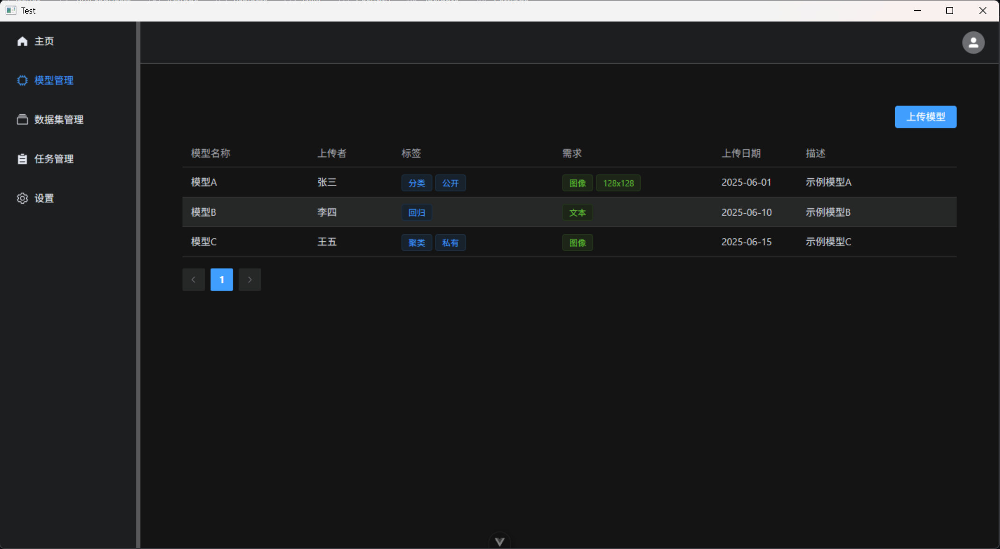
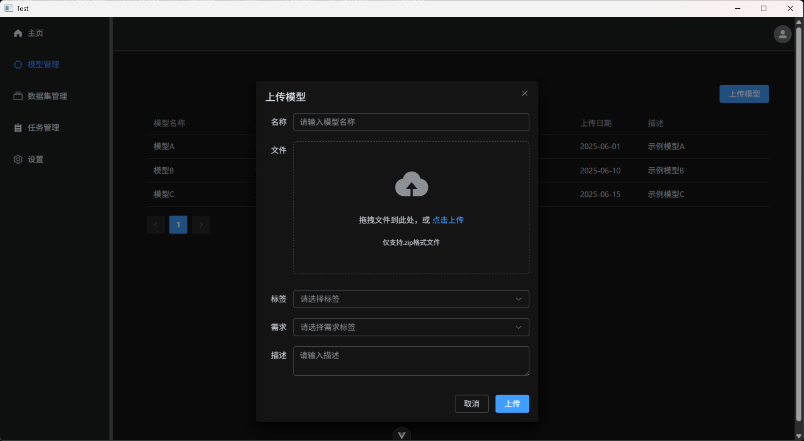
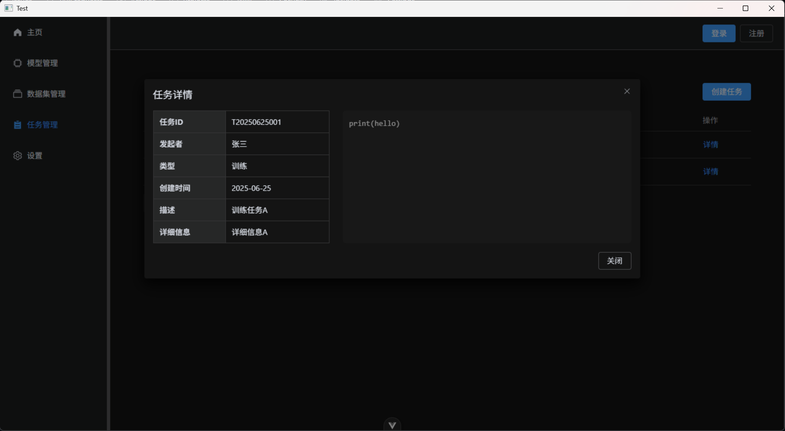
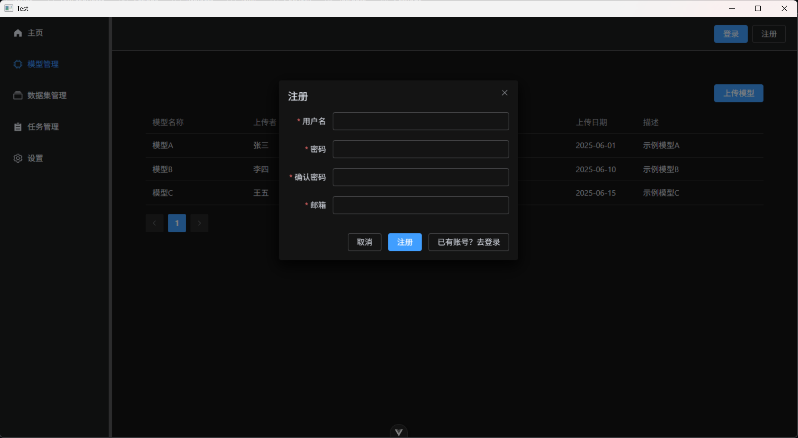
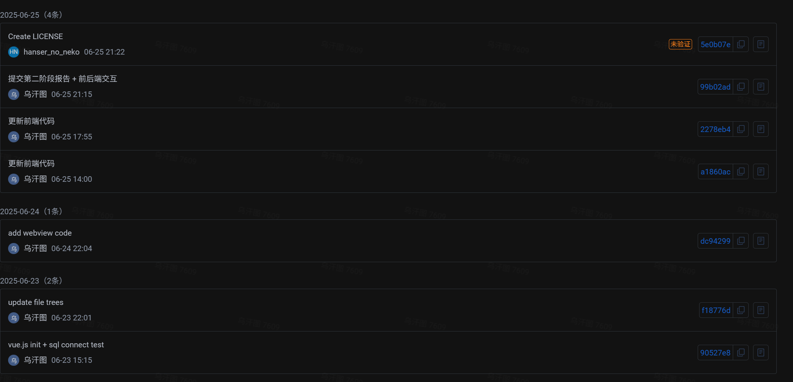

# 第二阶段报告

## 一、确认整体设计

基本确定项目开发方向，项目更名为 DL-modelboard | 深度学习模型托管平台。  
modelboard来源于tensorboard，意为像tensorboard一样具有看板，组合式训练模型并使用模型。
计划基本功能有：

- 模型上传
- 数据集上传
- 参数设定 + 模型训练

## 二、软件界面设计

本项目采用前后端分离架构，前端基于 Vue3 + Element Plus 实现，后端采用 Flask 框架。界面风格现代、简洁，配色使用了对程序员友好的深色模式（这样bug会少很多），整体布局分为侧边栏、顶栏和主内容区。

### 1. 总体布局

- **侧边栏**：位于页面左侧，包含主页、模型管理、数据集管理、任务管理、设置等导航菜单，支持拖拽调整大小与折叠。
- **顶栏**：位于页面顶部，右侧显示用户登录/注册按钮或用户头像及下拉菜单。
- **主内容区**：根据路由动态渲染各功能页面。

### 2. 主要界面设计

- **主页**：展示欢迎信息及系统信息等。
- **模型管理**：支持模型的上传、设定标签、分页浏览、详细信息查看等。
- **数据集管理**：支持数据集的上传、标签管理、分页浏览、详细信息查看等。
- **任务管理**：支持任务的创建管理（训练/预测）、任务列表分页浏览、任务详情展示。
- **设置**：用户可自定义部分系统参数。

### 3. 交互体验

- 所有表单均采用 Element Plus 组件构建，风格统一，交互友好。
- 上传、创建等操作均有弹窗与消息提示。
- 支持响应式布局，适配不同屏幕。

## 三、用户模块开发

### 1. 用户注册与登录

- 前端通过弹窗表单收集用户名、密码、邮箱等信息，用来注册与登录。
- 注册时校验用户名、邮箱唯一性，前后端均有校验。
- 登录时校验用户名和密码，支持错误提示。
- 前端通过 axios 向后端路由发送请求，后端返回 JSON 结果。

### 2. 后端实现

- 使用 Flask Blueprint 分离 `login` 和 `register` 路由，结构清晰。
- 用户信息分表存储：`users` 表保存基本信息，`passwd` 表保存加密密码。
- 注册流程：先插入 `users` 表，再插入 `passwd` 表，保证唯一性和数据一致性。
- 登录流程：先查 `users` 表获取用户 id，再查 `passwd` 表校验密码。
- 所有接口均返回标准 JSON，便于前端处理。
- 所有密码在后端均采用sha256加密存储，避免密码明文存储情况。

## 四、界面截图

以下使用WPF + WebView2构建窗口

- 模型管理页面：
  

- 数据集上传页面：
  

- 任务信息页面：
  

- 注册/登录页面：
  

