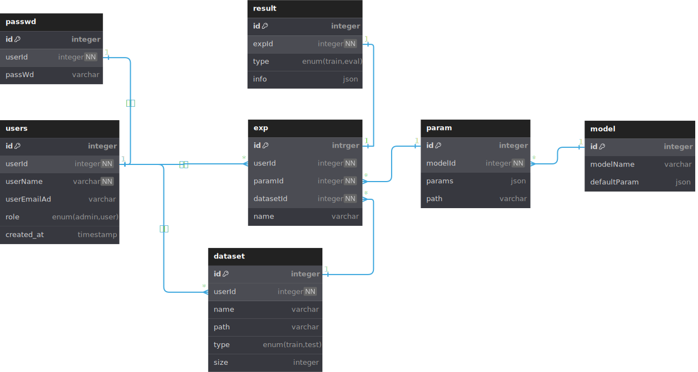

# 第一阶段报告

## 项目选题

根据任务书的项目描述，我觉得可以做一个深度学习模型托管平台，用户可以管理个人的模型，上传相关数据集，可以发起实验进行训练预测任务。也可以创建模型广场，用户可以使用其他用户制作上传的模型等。

## 数据库设计

我的项目目前设计了7个表分别是 :

- user
- passwd
- dataset
- exp
- result
- param
- model
  
其关系如下：

其中user表和passwd表用来存储用户基本信息和密码校验，密码不适用明文存储，在本地采用哈希校验策略。
param表和model表用来存储模型和参数。
exp表和result表用来存储实验记录和实验结果。
